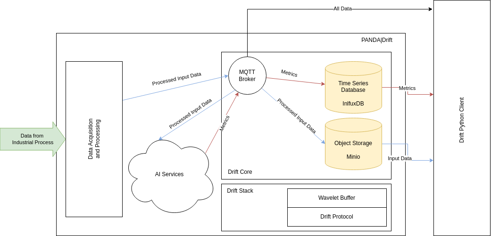

# What is PANDA|Drift?

_PANDA|Drift_ is a platform to bring AI applications into industrial environments, which provides the
following features:

**Data Acquisition**

The platform uses microservices to gather data from different data source.
For example, the data source could be an OPCUA or MODBUS server of an automation system, a vibration sensor or a CV camera.

**Data Processing**

AI applications need AI-ready data. _PANDA|Drift_ converts all data into a unified format, denoises and compresses it.
Check out our open-source library [WaveletBuffer][1] to see how we do this.

**Data Storing**

The platform stores a history of input data and results of AI algorithms,
so that they can be used for model training or validation and data visualization.

**AI Application Server**

An AI application can be easily integrated into _PANDA|Drift_ infrastructure as a microservice by using MQTT and
[DriftProtocol][2]

## Architecture

**PANDA|Drift** has a fine-grained microservice architecture.
However, here is an overview using high level components:

Our core technology is the MQTT protocol for real-time communication between microservices.
The Data Accusation layer collects data from data sources, denoises and compresses it by using [WaveletBuffer][1], then
wraps the data into [DriftProtocol][2] and sends it via MQTT, so that all other parts of the system can use it.

The AI Services process the input data and provide metrics as results. They could be anomaly scores,
coordinates of detected objects etc.

As you may notice, we have two types of data: processed input and metrics. _Drift Core_ keeps a history for both
of them, but it does it differently for both and for different purposes:

* Metrics are results of work of an AI application and this is data that users usually need. To store it, we use
  [InfluxDB](https://www.influxdata.com/products/influxdb-overview/) and keep data for long term storage.
* Input Data are mostly needed for training and model validation. We store it short term as blobs and provide HTTP access to it.

## Integration

To extend systems based on the platform or integrate them into a third-party infrastructure, we
developed [Drift Python Client][3] and made it available as an open-source library.

[1]:https://github.com/panda-official/WaveletBuffer

[2]:https://github.com/panda-official/DriftProtocol

[3]:https://github.com/panda-official/DriftPythonClient
